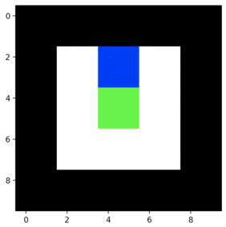

# Grid World Environment

This is a simple GridWorld Engine that is inspired by Google DeepMind Pycolab. 

I want this engine to be simple to understand in term of usage and the source code behide it. I hope to write a blog about this engine, after all the main features are finished.

## Run Demo
To Run the demo. For example, 

```
PYTHONPATH=. python3 GridWorld/demo/simple_gridworld.py
```

To Run the test files. For example, 

```
sh test_script.sh
```

## Todo

### Main Feature 
- [x] Simple Environment with render and action
- [x] Reward system
- [x] Reset env
- [x] Touchable box
- [ ] Consumable box
- [ ] Moveable box

### Harder Features 
- [ ] Multiplayer
- [ ] Faster(overall)
- [ ] Movable Objects (not player)
- [ ] Destroy Object

### Possible Game 
- [ ] Sokoban 

## Simple Example
From demo/simple_gridworld.py

We create a map adding customized player and object in scene.

```python
import numpy as np
from GridWorld.build_game import build_game
from GridWorld.Prefabs import player, static, interactive

ascii_art_world = ['#####',
                   '# P #',
                   '# I #',
                   '#   #',
                   '#####']

class DemoPlayer(player.Player):
    def __init__(self, color):
        super().__init__(color)

    def step(self, action):
        """Only up and down movement"""
        if action == 0:
            self._north()
        elif action == 1:
            self._south()

class GoldObj(interactive.Interactive):
    def __init__(self, color):
        super().__init__(color)

    def touch(self, env):
        env.add_reward(100)

    def consume(self, env):
        """Still Under developement"""

obj_information= {
    'P': DemoPlayer((0, 0, 255)),
    '#': static.Static((0, 0, 0)),
    'I': GoldObj((0, 255, 0))
}

env = build_game(ascii_art_world, obj_information, 2)
obs = env.reset()
env.display_map()

obs, reward, done = env.step(1)
print("Reward is {}".format(reward))
env.display_map()

obs, reward, done = env.step(1)
env.display_map()

```
So when player touch the object I, it get rewards 100.
and then move down again, noted that the reward block doesn't get destroyed (Next feature)


